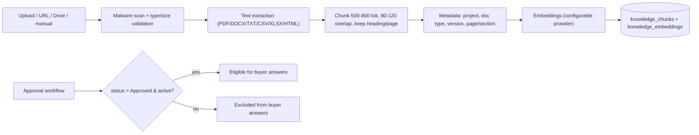
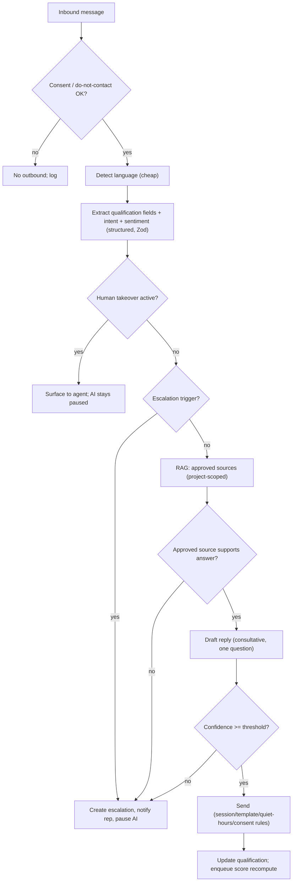

# AI System Design

Derived from [`MASTER_SPEC.md`](./MASTER_SPEC.md) §11–14. Covers the conversation engine, RAG knowledge pipeline, model routing, structured extraction, and escalation. Implemented in `packages/ai` with schemas in `packages/validation`.

---

## 1. Design tenets

1. **Grounded or silent.** Project-specific answers come only from Approved knowledge/inventory. No approved source → escalate, never invent.
2. **AI proposes, rules decide.** AI extracts signals and drafts replies; the deterministic engines own the official score ([`SCORING_ENGINE.md`](./SCORING_ENGINE.md)) and inventory facts ([`DATABASE.md`](./DATABASE.md)).
3. **Provider-neutral.** Claude/OpenAI/Gemini are interchangeable behind one interface; routing is configuration.
4. **Structured, validated I/O.** Every machine-consumed AI output is Zod-validated; malformed output is rejected.
5. **Untrusted documents.** Retrieved content is reference data, never instructions (prompt-injection defense, see [`SECURITY.md`](./SECURITY.md) §9).

## 2. Provider abstraction & model registry

### 2.1 Adapter interface

```ts
interface AIProvider {
  generateText(req): Promise<TextResult>;
  generateObject<T>(req, schema: ZodSchema<T>): Promise<{ data: T; usage: Usage }>;
  embed(texts: string[]): Promise<number[][]>;
}
// Implementations: AnthropicProvider, OpenAIProvider, GeminiProvider
```

### 2.2 Model registry & routing policy

`ai_model_registry` lists available models with capability tags and cost. `ai_routing_policies` selects a model per **task** scoped by platform/tenant/project/language/cost-limit, with a **fallback order**.

| Task class       | Default tier | Examples                                                                                                                                      |
| ---------------- | ------------ | --------------------------------------------------------------------------------------------------------------------------------------------- |
| Cheap/fast       | small model  | language detection, intent/message classification, field extraction, conversation summaries, FAQ routing                                      |
| Strong/reasoning | large model  | complex project comparison, ambiguous conversations, objection handling, low-confidence answers, multilingual reasoning, escalation summaries |

**Fallback:** on provider error, rate limit, timeout, or invalid structured output, route to the next model in the policy; record `fallback_used` in `ai_usage_events`.

### 2.3 Usage & cost tracking

Every call writes `ai_usage_events`: input/output tokens, estimated cost, latency, provider, model, tenant, conversation, task, success/failure, fallback. Tenant **monthly budgets** with soft (alert) and hard (block/queue) limits in `tenant_usage_limits`.

## 3. RAG knowledge pipeline

### 3.1 Ingestion → index



### 3.2 Document lifecycle

Statuses: **Draft → Processing → Needs review → Approved / Rejected → Archived / Expired**. Each document has tenant, project, type, version, effective/expiry dates, uploaded_by, approved_by, extraction status, last_indexed_at. **Only Approved + active (within effective/expiry) content is retrievable for customer answers.**

### 3.3 Retrieval (hybrid)

For a buyer question: detect project scope → run **vector similarity** (`pgvector`) + **full-text** (FTS) over `Approved` chunks filtered by `tenant_id`, `project_id`, doc type, version → merge/re-rank → return top chunks with page/section/version/scores. Inventory and project fields are first-class sources alongside documents.

### 3.4 Answer provenance

Every generated answer records (in `messages.ai_metadata` and `ai_extractions`): sources retrieved, document version, page/section, retrieval scores, model, prompt version, response confidence. Agents can inspect these in the inbox (source-evidence panel).

## 4. Conversation engine

### 4.1 Channels & languages

Channels: WhatsApp, website chat (architecture extensible to email/voice). Languages: English, Hindi, Kannada, Tamil, Telugu, Hinglish. Detect language per inbound message; reply in the lead's preferred language; **preserve project names, currency values, unit names, addresses verbatim** across translation.

### 4.2 Turn pipeline



### 4.3 Conversation style (system-prompt contract)

Conversational, polite, natural, concise, calm, consultative, non-robotic, intent-focused. Ask **one** main qualification question at a time; avoid interrogation; reuse prior answers; recognize partial answers; confirm ambiguities; vary wording; avoid excessive emojis, artificial urgency, and pressure; keep WhatsApp messages scannable; always offer a clear next action.

### 4.4 Answer boundaries

- **Project facts** (price, availability, unit number, discount, offer, possession date, approval, legal/construction status, amenity, payment plan, refund policy) — **only** from approved data; otherwise escalate. Never invented.
- **General domain questions** (carpet area meaning, buying process, site-visit prep, basic loan terms, apartment/villa/plot differences) — allowed, but clearly distinguished from verified project info. Not a general-purpose assistant.
- **Inventory freshness:** if a unit's `last_verified_at` is older than the tenant freshness limit (default 24h), the AI qualifies its answer and escalates availability confirmation to a human.

## 5. Structured extraction schema (Zod-validated)

Machine outputs include: extracted qualification fields, intent, sentiment, objection type, urgency, purchase timeline, budget, preferred location, configuration, property type, site-visit intent, human-escalation reason, AI confidence. Invalid outputs are rejected → fallback model or escalation. These feed `ai_extractions` and the scoring engine (signals only).

## 6. Escalation

**Immediate escalation triggers** (§12): lead requests a person; confidence below threshold (default 0.75); no approved source; custom-discount request; price negotiation; legal interpretation; payment dispute; lead reports incorrect info; conflicting availability; upset lead; ready to book; cancellation/refund; complex financing; safety/fraud/abuse.

**Escalation action:** identify/assign the responsible rep → in-app notification (and email when configured) → include a concise conversation summary, the unanswered question, lead score + reasons, and recommended next action → **pause AI**. AI resumes only via explicit setting or a defined timeout. Human takeover (`human_takeover_events`) likewise pauses AI for that conversation.

## 7. Prompt management

`prompt_templates` + `prompt_versions` store versioned, named prompts (system contracts, extraction prompts, summary prompts). The prompt version used is recorded with every answer for audit and A/B evaluation. `ai_evaluation_cases` + `ai_quality_reviews` support offline evaluation and human quality scoring.

## 8. Reliability

AI calls run inside durable workers (queue), not inline request handlers. Timeouts, retries with backoff, and fallback routing are standard. Budgets gate spend. All failures are logged with correlation IDs and surfaced on the admin health page (§32).

## 9. Testing focus

Unit: structured-output parsing/validation, language detection routing, grounding/escalation decision logic, freshness gating. Integration: provider fallback, RAG retrieval correctness on synthetic corpora, prompt-injection resistance (documents containing instructions must be ignored). See [`TEST_PLAN.md`](./TEST_PLAN.md).

## Phase 5A (2026-06-20)

Phase 5A lays the **knowledge, RAG and AI-safety foundation**. It introduces the full knowledge model, a hybrid retrieval pipeline, a provider-neutral AI abstraction, deterministic grounding/escalation, multilingual routing, usage/cost limits, an evaluation harness, and an agent-facing copilot — **without enabling any customer-facing AI answering**. The Phase 5B automatic responder stays disabled: `automatic` mode is always denied, `maySendAutomatically` is the literal `false`, and the database forbids an automatic AI run (`ai_runs` check `mode <> 'automatic'`).

This is detailed across new companion documents, which supersede the per-topic notes above for 5A:

- [`KNOWLEDGE_SYSTEM.md`](./KNOWLEDGE_SYSTEM.md) — source types, the eight-state lifecycle, versioning/rollback, approval rules, trust priority, effective/expiry, and the approved-only retrievability invariant.
- [`RAG_ARCHITECTURE.md`](./RAG_ARCHITECTURE.md) — deterministic chunking, model-agnostic `jsonb` embeddings (pgvector ANN deferred), hybrid retrieval (FTS + vector + exact FAQ + structured tools), deterministic rerank/dedup/sufficiency, scoping, and the orchestrator flow.
- [`AI_PROVIDERS.md`](./AI_PROVIDERS.md) — independent chat/embedding providers, mock-by-default, env-gated external stubs, error normalization, usage accounting, server-only credentials.
- [`GROUNDING_POLICY.md`](./GROUNDING_POLICY.md) — the deterministic grounding decision and "a draft only when grounded".
- [`AI_ESCALATION.md`](./AI_ESCALATION.md) — escalation categories/priority/actions; 5A only recommends.
- [`AI_EVALUATION.md`](./AI_EVALUATION.md) — the synthetic eval dataset and safety/quality scoring dimensions (not textual similarity).
- [`AI_SECURITY.md`](./AI_SECURITY.md) — the central `evaluateAiExecution` boundary, injection/SSRF defence, the read-only tool allow-list, no hidden reasoning, audit discipline, and RLS isolation.

The Phase 5A schema is migration [`0017_knowledge_ai_foundation.sql`](../supabase/migrations/0017_knowledge_ai_foundation.sql); the pure logic lives in the `packages/domain` AI modules; the server layer is `apps/web/src/lib/ai`.
