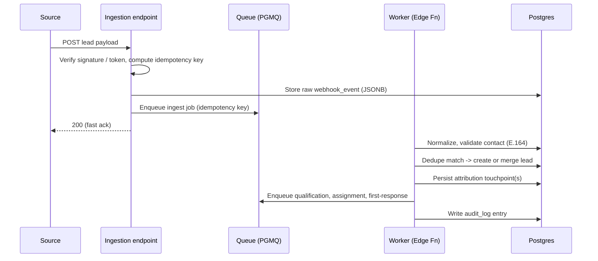
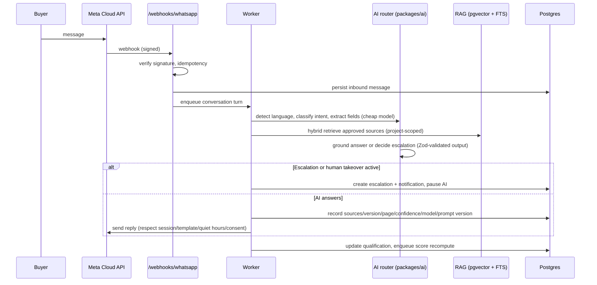

# Architecture

Derived from [`MASTER_SPEC.md`](./MASTER_SPEC.md) §2–4, §28–33. This document defines the system shape, tenancy model, runtime boundaries, package layout and the major data/processing flows.

---

## 1. Architectural goals

1. **Strict multi-tenant isolation** enforced at the database (RLS) and application (permission checks) layers, not just in UI.
2. **One codebase, two deployment modes** — shared multi-tenant and dedicated single-tenant — with no per-customer forks.
3. **Durable, idempotent processing** for everything that touches external systems (ingestion, messaging, AI, sync) — never only inside a browser request.
4. **Provider neutrality** for AI and messaging via adapter interfaces.
5. **Secrets never reach the browser.** Service-role keys and provider tokens live only server-side / in Edge Functions.
6. **Explainability and auditability** as first-class architectural concerns (score history, message reasons, merge reversibility, audit logs).

## 2. High-level system diagram

```mermaid
flowchart TB
    subgraph Clients["Client surfaces"]
        Buyer["Buyer (WhatsApp / Website chat widget)"]
        AgentUI["Agent & Manager (Web app, PWA, mobile)"]
        Admin["Platform Super Admin"]
    end

    subgraph Sources["Lead sources"]
        Ads["Google / Meta Ads & lead forms"]
        Portals["Portals: NoBroker, 99acres, Housing, Magicbricks"]
        Forms["Website forms"]
        Files["CSV / XLSX import"]
        GmailIn["Gmail lead notifications"]
        API["Generic API / Webhook"]
    end

    subgraph Vercel["Vercel — apps/web (Next.js App Router)"]
        RSC["Server Components & Server Actions"]
        Routes["Route Handlers: /api/v1, /webhooks, /chat, /forms"]
        MW["Middleware: tenant resolution, auth, security headers, rate limit"]
    end

    subgraph Supabase["Supabase (per deployment: shared or dedicated)"]
        Auth["Auth (sessions, MFA)"]
        PG[("PostgreSQL + RLS + pgvector + FTS")]
        Storage["Storage (media, documents)"]
        Realtime["Realtime (inbox, notifications)"]
        Edge["Edge Functions (webhooks, workers, AI calls)"]
        Queue["PGMQ / Queues + pg_cron"]
    end

    subgraph Providers["External providers (server-side only)"]
        AIers["AI: Anthropic / OpenAI / Gemini"]
        WA["WhatsApp: Meta Cloud / Gupshup / Twilio"]
        Google["Gmail + Google Calendar"]
        Sentry["Sentry / logging"]
    end

    Buyer <--> WA
    WA <--> Edge
    Forms --> Routes
    Ads --> Routes
    Portals --> Routes
    API --> Routes
    GmailIn --> Edge
    Files --> RSC

    AgentUI <--> RSC
    AgentUI <--> Routes
    AgentUI <--> Realtime
    Admin <--> RSC

    MW --- RSC
    MW --- Routes
    RSC --> PG
    Routes --> PG
    Routes --> Queue
    Edge --> PG
    Edge --> Queue
    Queue --> Edge
    Edge --> AIers
    Edge --> WA
    Edge --> Google
    RSC --> Storage
    RSC -. errors/logs .-> Sentry
    Edge -. errors/logs .-> Sentry
    Realtime --- PG
```



## 3. Tenancy model

### 3.1 Identity of a tenant

A **tenant** = one real-estate client. Every tenant-owned row carries `tenant_id uuid not null`. A user (`profiles`) may belong to one or more tenants through `memberships`, which carry the role and permission set for that tenant. The **active tenant** is resolved per request.

### 3.2 Tenant resolution (request lifecycle)

1. **Custom domain / subdomain** → middleware looks up `tenants` by host (`tenant_branding.custom_domain` or platform subdomain).
2. **Authenticated session** → the user's membership for that tenant is loaded; a Postgres session GUC (e.g. `request.tenant_id`) and the JWT claim are used by RLS.
3. **Permission context** → effective permissions = role permissions ⊕ per-user grants/revocations.
4. Requests without a valid membership for the resolved tenant are rejected before any data access.

### 3.3 Isolation enforcement (defense in depth)

- **Database:** RLS policies on every tenant table key off the JWT/GUC `tenant_id`. See [`SECURITY.md`](./SECURITY.md).
- **Application:** server actions and route handlers re-check `tenant_id` + permission before mutations; never trust client-supplied `tenant_id`.
- **Storage:** object paths are tenant-prefixed; access via signed URLs gated by permission checks.
- **Super Admin:** has no silent cross-tenant data path. Support access uses an explicit, time-limited, audited impersonation flow.

### 3.4 Deployment modes

- **Shared:** one Supabase project + one Vercel project serve many tenants. Isolation via `tenant_id` + RLS. Custom domains map to tenants.
- **Dedicated enterprise:** same code, env-selected to point at a dedicated Supabase project/domain for one large client. Tenancy code still runs (single tenant), so there is exactly one code path. Selection is via environment configuration (`packages/config`), not code branches.

## 4. Runtime components

| Component                                           | Runtime           | Responsibility                                                                                |
| --------------------------------------------------- | ----------------- | --------------------------------------------------------------------------------------------- |
| `apps/web` Server Components / Server Actions       | Vercel (Node)     | Authenticated UI rendering and primary mutations (with permission + tenant checks)            |
| Route Handlers `/api/v1/*`                          | Vercel            | Documented public/integration API (auth, tenant scoping, pagination, idempotency, versioning) |
| Route Handlers `/webhooks/*`, `/forms/*`, `/chat/*` | Vercel or Edge    | Inbound ingestion endpoints; verify authenticity, enqueue durable jobs                        |
| Edge Functions                                      | Supabase          | Webhook processors, queue workers, AI calls, provider calls — where secrets live              |
| Queues (PGMQ) + `pg_cron`                           | Supabase/Postgres | Durable job transport, scheduled follow-ups, retries, DLQ                                     |
| Realtime                                            | Supabase          | Live inbox, notifications, presence                                                           |
| PostgreSQL                                          | Supabase          | System of record, RLS, vector + full-text search, triggers, history tables                    |

**Rule:** any multi-step workflow that calls an external system or must survive a page navigation runs as a durable job, not inline in a request. The request enqueues; a worker executes with retry/backoff/idempotency.

## 5. Monorepo / package layout

```text
apps/web/                 Next.js App Router application (UI, route handlers, server actions)
packages/
  ui/                     shadcn/ui-based component library + design tokens (UI_SYSTEM.md)
  domain/                 pure business logic: scoring, matching, dedupe, assignment, follow-up rules
  validation/             Zod schemas shared by API, forms, AI structured outputs
  ai/                     provider adapters, model registry, prompt templates, embeddings, usage tracking
  integrations/           messaging adapters (WhatsApp/Gupshup/Twilio), Gmail, Calendar, portal parsers
  analytics/              metric definitions, aggregation helpers
  config/                 env validation (Zod), feature flags, plan limits, deployment-mode selection
supabase/
  migrations/             SQL migrations (source of truth for schema + RLS)
  seed/                   synthetic seed data
  functions/              Edge Functions
  tests/                  pgTAP / SQL tests (RLS, constraints, triggers)
docs/                     this documentation set
```

**Dependency direction:** `domain`, `validation`, `config` are dependency-free leaves. `ai`, `integrations`, `analytics`, `ui` may depend on them. `apps/web` depends on everything. No package depends on `apps/web`. Business rules in `domain` are framework-agnostic and unit-testable in isolation (scoring, matching, dedupe must be pure functions).

## 6. Major flows

### 6.1 Inbound lead (form / webhook / ad)



### 6.2 Inbound WhatsApp message → AI reply



### 6.3 Score recompute (hybrid)

AI extraction (signals) is stored; the **deterministic** scoring engine in `packages/domain` reads signals + lead/inventory facts, applies the active `scoring_rule_version`, writes `score_calculations` + `score_components` + `score_events`, sets category, and may trigger automations. The AI never writes the final number. Detail in [`SCORING_ENGINE.md`](./SCORING_ENGINE.md).

## 7. Cross-cutting concerns

- **Security:** [`SECURITY.md`](./SECURITY.md) — RLS, permissions, secrets, webhook verification, prompt-injection defense, PII masking, do-not-contact enforcement.
- **AI:** [`AI_SYSTEM.md`](./AI_SYSTEM.md) — conversation engine, RAG, routing, structured outputs, escalation.
- **Data:** [`DATABASE.md`](./DATABASE.md) — full schema + ERD.
- **Reliability:** durable queues, retry with exponential backoff, max attempts, dead-letter table, manual replay, correlation IDs. Every job log carries `correlation_id`, `tenant_id`, `source_event_id`.
- **Observability:** structured logs, Sentry, webhook/job/AI-call logs, integration health checks, admin system-health page; secrets/PII redacted.
- **Config & flags:** `packages/config` validates env at boot (Zod) and exposes typed feature flags + plan limits; deployment mode is environment-selected.

## 8. Technology decisions and rationale

| Decision                                               | Rationale                                                                                                                                              |
| ------------------------------------------------------ | ------------------------------------------------------------------------------------------------------------------------------------------------------ |
| Next.js App Router + Server Actions                    | Co-locate server logic with UI, keep secrets server-side, stream RSC for fast dashboards                                                               |
| Supabase (Postgres + Auth + Storage + Edge + Realtime) | One platform covers relational data with RLS, auth, file storage, realtime inbox, and serverless workers; pgvector + FTS enable hybrid RAG in-database |
| PGMQ/Queues + pg_cron                                  | Durable in-database jobs and scheduling without a separate broker; transactional with data writes                                                      |
| Provider-adapter pattern for AI + messaging            | Spec requires Claude/OpenAI/Gemini and Meta/Gupshup/Twilio interchangeability                                                                          |
| Pure `domain` package                                  | Scoring/matching/dedupe must be deterministic and unit-tested independent of framework/DB                                                              |
| pnpm workspace                                         | Enforced dependency boundaries, fast installs, exact version pinning                                                                                   |

## 9. What Phase 0 does **not** decide

Concrete library versions are pinned in Phase 1's lockfile (spec requires "current stable, mutually compatible, pinned exactly"). Phase 0 fixes the _shape_; Phase 1 fixes the _versions_. See [`IMPLEMENTATION_PLAN.md`](./IMPLEMENTATION_PLAN.md).

## Phase 5A (2026-06-20)

Phase 5A adds the AI/knowledge layer while preserving the dependency direction (`domain`/`validation`/`config` remain leaves; the app depends on all; nothing depends on the app).

**New pure modules in `packages/domain/src`** (framework- and DB-independent, exhaustively unit-tested):

- `ai-guard.ts` — the central `evaluateAiExecution` boundary (four operating levels; `automatic` always denied; `maySendAutomatically` literal `false`).
- `chunking.ts` — deterministic, reproducible chunking + FNV-1a checksums.
- `ai-providers.ts` — provider-neutral chat/embedding interfaces, deterministic mocks, error normalization, cosine similarity.
- `retrieval.ts` — pure hybrid-candidate rerank/dedup/sufficiency.
- `grounding.ts` — the deterministic grounding decision.
- `ai-escalation.ts` — escalation category/priority/action mapping.
- `knowledge.ts` — lifecycle state machine, approval rules, version activation, conflict detection.
- `prompt-injection.ts` — untrusted-content detection + `wrapUntrustedContext`.
- `ai-language.ts` — language detection + routing.
- `ai-cost.ts` — usage/cost limits + circuit breaker.
- `ai-eval.ts` — evaluation scoring across safety/quality dimensions.

**New server layer `apps/web/src/lib/ai`** (server-only; secrets never reach the browser):

- `providers.ts` — env-gated provider factory (mock by default).
- `url-safety.ts` — SSRF guard for ingest-by-URL.
- `ingestion.ts` — durable, idempotent ingestion pipeline (extract → inject-detect → chunk → embed → version → `review_required`).
- `retrieval.ts` — approved/in-effect/scoped candidate retrieval (FTS + vector + exact FAQ) and grounding-evidence assembly.
- `tools.ts` — the read-only dynamic-tool allow-list.
- `orchestrator.ts` — `runAiAnswer` assembly (gate → language → limits → retrieval → tools → grounding → escalation → draft → persist), never sends.

**New routes** under `apps/web/src/app/(app)`: `knowledge/` (sources, new, detail, review), `settings/ai/` (providers, models, prompts, policies, usage), `ai/test-lab/` and `ai/actions.ts`, plus the inbox copilot panel. The full directory layout in §5 is unchanged in shape. See [`AI_SYSTEM.md`](./AI_SYSTEM.md) and its companion docs.

## Phase 6A (2026-06-20)

Phase 6A adds **deterministic lead scoring** while preserving the dependency direction and the durable-job boundary. Scoring is **advisory / record-only**: it never changes a lead's stage, assignment, status, or conversation mode, and never sends anything.

- **New pure module** `packages/domain/src/scoring.ts` — `calculateLeadScore` (deterministic, versioned, explainable, no IO) plus `effectiveScore`, `validateThresholds`, `assertNoProhibitedSignals`, `isProhibitedSignal`. It remains a dependency-free leaf, exhaustively unit-tested.
- **Schema** `supabase/migrations/0021_lead_scoring.sql` — 14 tenant-scoped tables (model catalogue, signal definitions, observations, version-stamped score runs, append-only history, overrides, evaluation), RLS on all, an immutable-active-version trigger, a one-active-version index, and fairness CHECKs mirroring the domain prohibited-signal catalogue.
- **Server layer** — a thin record-only service that calls the pure calculation and persists a version-stamped run + components + history delta; recalculation runs through the existing durable-job abstraction (`apps/web/src/lib/jobs/`, local-sync today; PGMQ deferred). It never mutates lead stage/assignment/status or any outbound path.
- **Recompute triggers** are meaningful events only (lead created, preference/qualification change, meaningful inbound, call logged, task completed, site visit recorded, reviewed source correction, duplicate resolution, AI extraction approved, model version activated, manual request) — never every insignificant event.

The §6.3 "Score recompute" flow describes the eventual hybrid pipeline; Phase 6A delivers its deterministic core and advisory surface. See [`SCORING_ARCHITECTURE.md`](./SCORING_ARCHITECTURE.md) and its companions.

## Phase 6B (2026-06-20)

Phase 6B adds **deterministic project matching** while preserving the dependency direction and the durable-job boundary. Matching **builds on** the scoring core and is **advisory / record-only**: it never assigns a lead, changes a lead's stage, status, or score, reserves or books inventory, or sends anything.

- **New pure module** `packages/domain/src/matching.ts` — `calculateProjectMatches({ modelVersion, leadSnapshot, candidates, calculatedAt })` (deterministic, versioned, explainable, no IO) plus `assertNoProhibitedMatchInputs`. Three match levels (project / configuration / unit) treated distinctly; 14 operators; rule kinds hard/soft/informational/review_required; 12 rule groups with caps/minimums; 7 eligibility gates (ineligible → score 0, ranked last); 6 inventory states (unit confirmed only when `verified_available`); 7 budget outcomes; match confidence and preference completeness tracked separately from the score; stable ranking (eligible first, score desc, tie-break by candidateId). It remains a dependency-free leaf, exhaustively unit-tested.
- **Schema** `supabase/migrations/0022_project_matching.sql` — 14 tenant-scoped tables (model catalogue, rules, version-stamped match runs, candidates, components, inventory snapshots, overrides, feedback, evaluation), RLS on all, an immutable-active-version trigger, a one-active-version index, and a prohibited-input CHECK rejecting prohibited signals on **both** `signal_key` and `candidate_field`.
- **Server layer** — a thin record-only service: candidate generation from real projects/configs/inventory under RLS; `runLeadMatch` persists a version-stamped run + candidates + components + inventory snapshots and mutates nothing; override + feedback services; review-only AI preference extraction (AI never determines the ranking). Recalculation runs through the existing durable-job abstraction (`apps/web/src/lib/jobs/`, local-sync today; PGMQ deferred).
- **Recompute triggers** are meaningful events only (lead created, preference/qualification change, meaningful inbound, AI preference extraction approved, inventory/pricing change affecting fit, project activation/approval/visibility/retirement, model version activated, manual request) — never every insignificant event.

The §7 project-matching engine in [`SCORING_ENGINE.md`](./SCORING_ENGINE.md) describes the eventual full system; Phase 6B delivers its deterministic core and advisory surface. The Phase 5B.1 external stop-line is preserved unchanged: automatic customer sending remains impossible, and scoring and matching are advisory-only. See [`MATCHING_ARCHITECTURE.md`](./MATCHING_ARCHITECTURE.md) and its companions.

## Phase 7A note — external integration foundation

Phase 7A adds a provider-neutral **external integration foundation** while
preserving the dependency direction and the durable-job boundary. It performs
**no external IO**: it sends nothing, connects to no live provider, and verifies
no real webhook domain. Everything is **implemented locally / simulated /
mock-only**. The frozen safety switches are preserved unchanged
(`LIVE_SEND_MASTER_SWITCH=false`, `RESPONDER_LIVE_SENDING=false`, advisory-only
scoring + matching, record-only AI outbox, automatic customer sending impossible).

- **New pure module** `packages/domain/src/integrations.ts` — the
  `ExternalIntegrationAdapter` contract, the `NormalizedExternalEvent` envelope,
  deterministic idempotency and webhook-acceptance decisions, WhatsApp / email /
  portal normalization, health / failure / replay classification, and
  deterministic mock / failure / malformed / duplicate / out-of-order adapters. It
  is a dependency-free leaf with no IO (HMAC signing is done by the caller; only
  the constant-time comparison lives in the domain), exhaustively unit-tested.
- **Schema** `supabase/migrations/0024_integration_foundation.sql` — 33
  tenant-scoped RLS tables, 16 permissions, 24 audit actions, a per-tenant
  synthetic `manual_test` seed, and a DB `CHECK (status <> 'connected')` that
  makes a live connection impossible in 7A. Credentials store a `secret_ref` +
  safe metadata only, never a plaintext secret. Human outbound is
  simulation-only (`CHECK simulated = true`).
- **Server / UI** — a thin record-only surface (`/settings/integrations*`,
  `/integrations/events`, the webhook route shape) that persists normalized events
  and simulates human outbound; no path reaches a live provider. The exact server
  file inventory is reconciled by the parent agent and described honestly as mock
  / simulation / record-only.

All real provider IO, credentials, accounts, webhook-domain verification, provider
app review, Pub/Sub, IMAP/SMTP, paid services, compliance approval, live Supabase,
production queues / monitoring, Storage, and any live send are **Phase 7B**. See
[`INTEGRATION_ARCHITECTURE.md`](./INTEGRATION_ARCHITECTURE.md) and its companions.
