# Database Model

Derived from [`MASTER_SPEC.md`](./MASTER_SPEC.md) §7. PostgreSQL on Supabase. Schema is owned by SQL migrations in `supabase/migrations/` (source of truth). This document defines conventions, the core ERD, and the full table catalog by domain.

---

## 1. Conventions

- **Primary keys:** `id uuid default gen_random_uuid()`.
- **Tenant scoping:** every tenant-owned table has `tenant_id uuid not null references tenants(id)`. RLS keys off this. Platform-only tables (e.g. `tenants`, `feature_flags`) are excluded and gated by super-admin checks.
- **Timestamps:** `created_at timestamptz default now()`, `updated_at timestamptz` (trigger-maintained). History/event tables are append-only.
- **Soft delete:** only where recovery is valuable (`deleted_at timestamptz null`); not a substitute for proper lifecycle states. Most lifecycle is modelled with explicit status columns + history tables.
- **Money:** `numeric(14,2)` with a `currency` column (tenant default INR). **Phone:** stored E.164 (`text`) plus a normalized "national" form for prefix-insensitive matching. **Enums:** Postgres `enum` or `text` + `check` constraint, defined in migrations.
- **JSONB:** raw provider payloads stored for audit (`raw_payload jsonb`); fields needed for querying are normalized into columns.
- **Auditing:** mutations to sensitive tables write to `audit_logs` (who/what/when/before/after) via triggers or domain code.
- **Indexes:** every FK indexed; `(tenant_id, <high-selectivity column>)` composite indexes for list/filter paths; GIN for FTS (`tsvector`) and JSONB; `ivfflat`/`hnsw` for `knowledge_embeddings`.
- **Vector search:** `pgvector` on `knowledge_embeddings`; full-text on leads/messages/notes/knowledge for global search.

## 2. Core ERD (key entities)

> The full system has ~150 tables (§7). This ERD shows the central relationships; secondary tables are listed in §3 with their parents.

```mermaid
erDiagram
    tenants ||--o{ memberships : has
    tenants ||--|| tenant_branding : has
    tenants ||--|| tenant_settings : has
    tenants ||--o{ tenant_features : has
    tenants ||--o{ projects : owns
    tenants ||--o{ leads : owns
    tenants ||--o{ roles : defines

    profiles ||--o{ memberships : joins
    roles ||--o{ role_permissions : grants
    permissions ||--o{ role_permissions : in
    memberships }o--|| roles : assigned

    projects ||--o{ project_configurations : has
    projects ||--o{ project_offers : has
    projects ||--o{ inventory_units : contains
    projects ||--o{ knowledge_documents : scopes
    inventory_units ||--o{ inventory_status_events : logs
    inventory_units ||--o{ inventory_price_history : logs

    leads ||--o{ lead_contacts : has
    leads ||--|| lead_preferences : has
    leads ||--o{ lead_source_events : from
    leads ||--o{ attribution_touchpoints : tracks
    leads ||--o{ lead_assignments : assigned
    leads ||--o{ lead_notes : has
    leads ||--o{ lead_stage_history : moves
    leads ||--o{ conversations : has
    leads ||--o{ score_calculations : scored
    leads ||--o{ site_visits : schedules
    leads ||--o{ lead_duplicates : flagged

    conversations ||--o{ messages : contains
    conversations ||--o{ conversation_summaries : summarized
    conversations ||--o{ human_takeover_events : toggled
    messages ||--o{ message_attachments : has

    score_calculations ||--o{ score_components : breaks_down
    scoring_rule_sets ||--o{ scoring_rules : contains
    scoring_rule_sets ||--o{ scoring_rule_versions : versioned

    knowledge_documents ||--o{ knowledge_document_versions : versioned
    knowledge_documents ||--o{ knowledge_chunks : split
    knowledge_chunks ||--|| knowledge_embeddings : embeds

    pipelines ||--o{ pipeline_stages : has
    follow_up_sequences ||--o{ follow_up_steps : has
    follow_up_sequences ||--o{ follow_up_enrollments : enrolls
    leads ||--o{ follow_up_enrollments : in

    agents_profiles ||--o{ lead_assignments : receives
    site_visits ||--o{ site_visit_attendees : with
    site_visits ||--o{ site_visit_events : logs
```

_(`agents_profiles` above denotes a membership acting as a sales agent, via `memberships` + `agent_availability`/`agent_skills`.)_

## 3. Full table catalog (by domain)

Tables exactly follow [`MASTER_SPEC.md` §7]. Each tenant-owned table includes `tenant_id`.

### 3.1 Tenant & identity

`tenants`, `tenant_branding`, `tenant_settings`, `tenant_features`, `tenant_usage_limits`, `profiles`, `memberships`, `roles`, `permissions`, `role_permissions`, `user_permissions`, `invitations`, `agent_availability`, `agent_skills`.

- `tenants` — platform table; name, slug, plan, status (active/suspended), deployment_mode.
- `tenant_branding` — logo, favicon, colours, themes, login image, custom_domain, terminology overrides.
- `tenant_settings` — timezone, locale, currency, working/quiet hours, escalation threshold, inventory freshness, default language + enabled languages, AI provider config (non-secret), legal/privacy links.
- `memberships` — (tenant_id, profile_id, role_id, status); the join carrying a user's role in a tenant.
- `permissions` — catalog of granular permission keys (see [`PERMISSIONS_MATRIX.md`](./PERMISSIONS_MATRIX.md)); `role_permissions` / `user_permissions` for grants and per-user overrides.

### 3.2 Real-estate projects

`projects`, `project_types`, `project_locations`, `project_landmarks`, `project_amenities`, `project_configurations`, `project_payment_plans`, `project_offers`, `project_media`, `project_documents`, `project_faqs`, `project_status_updates`.

### 3.3 Inventory

`inventory_units`, `inventory_status_events`, `inventory_price_history`, `towers_or_blocks`, `floors`, `unit_configurations`, `inventory_imports`, `inventory_import_rows`.

- `inventory_units.status` enum: **Available, Temporarily held, Reserved, Booked, Sold, Blocked, Unavailable**.
- Freshness: `last_verified_at timestamptz`; surfaced to AI to gate availability claims.
- `inventory_status_events` / `inventory_price_history` — append-only change logs.

### 3.4 Leads

`leads`, `lead_contacts`, `lead_preferences`, `lead_custom_fields`, `lead_sources`, `lead_source_events`, `attribution_touchpoints`, `lead_duplicates`, `duplicate_resolution_events`, `lead_assignments`, `lead_notes`, `lead_tags`, `lead_stage_history`, `lost_reasons`, `lead_activity_events`.

- `lead_contacts` — phone(s) E.164 + national form, email(s), with a canonical flag.
- `attribution_touchpoints` — preserves first-touch and last-touch and every touch in between.
- `lead_duplicates` — candidate pairs with confidence (exact/probable/possible); `duplicate_resolution_events` — reversible merge records.

### 3.5 Communication

`channel_accounts`, `conversations`, `conversation_participants`, `messages`, `message_attachments`, `message_delivery_events`, `human_takeover_events`, `conversation_summaries`, `consent_events`, `do_not_contact_entries`.

- `messages` — direction, channel, body, `raw_payload jsonb`, language, `ai_metadata jsonb` (model, prompt version, sources, confidence) for AI-authored messages.
- `do_not_contact_entries` — enforced before any outbound automation.

### 3.6 Scoring & qualification

`qualification_fields`, `lead_qualification_values`, `scoring_rule_sets`, `scoring_rules`, `scoring_rule_versions`, `score_calculations`, `score_components`, `score_events`, `ai_extractions`, `scoring_simulations`.

- `ai_extractions` — AI-derived signals (Zod-validated) with confidence; inputs to the deterministic engine, never the final score.
- `score_calculations` + `score_components` — the official 0–100 score and per-component breakdown; `score_events` — the full history with causing event and rule version.

### 3.7 Pipeline & sales operations

`pipelines`, `pipeline_stages`, `tasks`, `calls`, `site_visits`, `site_visit_attendees`, `site_visit_events`, `booking_records`, `follow_up_sequences`, `follow_up_steps`, `follow_up_enrollments`, `scheduled_actions`, `notifications`.

### 3.8 AI & knowledge

`knowledge_documents`, `knowledge_document_versions`, `knowledge_chunks`, `knowledge_embeddings`, `prompt_templates`, `prompt_versions`, `ai_model_registry`, `ai_routing_policies`, `ai_usage_events`, `ai_quality_reviews`, `ai_evaluation_cases`.

- `knowledge_documents.status` enum: **Draft, Processing, Needs review, Approved, Rejected, Archived, Expired**; only Approved+active reaches buyers.
- `knowledge_embeddings` — `vector` column + `ivfflat`/`hnsw` index; chunk metadata preserves page/section/version.
- `ai_usage_events` — input/output tokens, cost, latency, provider, model, task, success/fallback for budgets.

### 3.9 Integrations & reliability

`integrations`, `integration_credentials_metadata`, `webhook_events`, `webhook_delivery_attempts`, `idempotency_keys`, `integration_sync_runs`, `dead_letter_events`, `import_jobs`, `import_errors`.

- `integration_credentials_metadata` — **metadata only**; secrets live in a server-side vault / encrypted store, never in browser-reachable tables.
- `idempotency_keys` — dedupe of inbound events and outbound sends.
- `dead_letter_events` — failed jobs after max attempts, with replay support.

### 3.10 Platform operations

`audit_logs`, `security_events`, `usage_records`, `subscriptions`, `invoices`, `feature_flags`, `system_health_events`.

## 4. History & event tables

Append-only tables back explainability and auditability: `lead_stage_history`, `score_events`, `inventory_status_events`, `inventory_price_history`, `human_takeover_events`, `message_delivery_events`, `duplicate_resolution_events`, `site_visit_events`, `audit_logs`, `security_events`. These are write-once (insert/triggers), never updated in place.

## 5. Search & retrieval

- **Global search** (§26): GIN `tsvector` indexes on leads (name/phone/email derived), messages, notes; plus project/unit/agent/source/campaign lookups, unioned and tenant-scoped.
- **RAG retrieval:** hybrid of `pgvector` similarity on `knowledge_embeddings` and FTS on `knowledge_chunks`, filtered by `tenant_id`, `project_id`, document type, version, and `status = Approved`. See [`AI_SYSTEM.md`](./AI_SYSTEM.md).

## 5a. Audit domain (Phase 1.1, migration `0005`)

Enums `audit_event_category`, `security_event_severity`, `security_event_status`; catalogue table `audit_actions` (FK target for `audit_logs.action`); `audit_logs` (append-only, full actor/entity/diff/context columns + indexes); `security_events` (deduplicated, resolvable). `tenant_settings.audit_retention_days` added. Full design, columns and RLS in [`AUDIT_LOGGING.md`](./AUDIT_LOGGING.md). These are the first tables realised from §3.10 `audit_logs` / `security_events`.

## 5b. Projects & inventory (Phase 2, migration `0006`)

Enums (`project_category`, `project_sale_status`, `project_approval_status`, `construction_status`, `inventory_status` with the 7 required statuses, `import_status`); tables `projects`, `project_configurations`, `project_amenities`, `project_offers`, `towers_or_blocks`, `floors`, `inventory_units` (with `last_verified_at` freshness), append-only `inventory_status_events` + `inventory_price_history` (written by a SECURITY DEFINER trigger), `inventory_imports`, `inventory_import_rows`. RLS: read = `projects.read`/`inventory.read`, write = `projects.manage`/`inventory.manage`, import = `inventory.import`; history is read-only to tenant users. New audit actions seeded.

Project content (Phase 2 remainder, migration `0007`): `project_faqs`, `project_media`, `project_documents` (URL-referenced metadata; direct binary upload to Storage is a later pass), all with `projects.read`/`projects.manage` RLS.

## 5c. Leads & pipeline (Phase 3, migration `0008`)

`leads` (+ contacts, preferences, source events, attribution touchpoints), `lead_sources`, `pipelines` + `pipeline_stages` (default 12-stage pipeline seeded per tenant), `lead_assignments` (one active per lead), `lead_notes`, `lead_tags`, `lead_stage_history`, `lead_activity_events`, `lead_duplicates` + `duplicate_resolution_events` (reversible merges), `tasks`, `lost_reasons`. **Assignment-scoped RLS**: agents see only leads assigned to them (`leads.read.assigned` + `current_user_assigned()`); team/all readers see more; child tables inherit the parent lead's visibility. A `has_raw_permission()` helper checks exact (non-implied) read scope; `current_user_assigned()` is SECURITY DEFINER to avoid a leads↔assignments policy recursion.

Broker/direct overlap (Phase 3 remainder, migration `0009`): `lead_duplicates.is_broker_conflict` + `duplicate_resolution_events.source_precedence` / `commission_exposure`, and a `broker_overlap_metrics` view (conflicts identified per tenant). Ownership is never auto-decided.

Current migration set: `0001`–`0009` (`extensions`, `identity_tenancy`, `auth_context`, `roles_seed_and_rls`, `audit_logging`, `projects_inventory`, `project_content`, `leads_pipeline`, `broker_overlap`); sequential, validated by `scripts/check-migration-order.mjs`.

## 6. Migration & seeding

- All schema, RLS policies, functions and triggers are created via numbered SQL migrations committed to `supabase/migrations/`.
- `supabase/seed/` provides **synthetic** tenants, projects, inventory, leads and conversations for local/staging — never real names/phones from prototypes (§28).
- RLS, constraints, triggers and history behaviour are tested with pgTAP/SQL tests in `supabase/tests/` (§31). See [`TEST_PLAN.md`](./TEST_PLAN.md).

## Migration 0010 — ingestion idempotency & CRM (Phase 3.1)

Enums: `ingestion_status`, `job_status`, `public_form_status`, `call_direction`,
`call_status` (connected / no_answer / busy / wrong_number / switched_off /
callback_requested / cancelled), `qualification_importance`, `saved_view_scope`.

Tables (all tenant-scoped, RLS default-deny):

- **`idempotency_keys`** — unique `(tenant_id, scope, idem_key)`.
- **`lead_ingestion_events`** — unique `(tenant_id, idempotency_key)` + partial
  unique `(tenant_id, source_id, external_event_id)`; carries `payload_hash`,
  `status`, `attempt_count`, `next_retry_at`, `resulting_lead_id`, `correlation_id`.
- **`lead_ingestion_attempts`** — per-attempt log (inherits `leads.read.team`).
- **`background_jobs`** / **`dead_letter_events`** — durable-job + DLQ records,
  readable with `settings.audit.read`.
- **`public_lead_forms`** / **`public_lead_form_domains`** /
  **`public_lead_form_submissions`** — public-form config + origin allow-list +
  submission log; managed with `forms.manage`.
- **`saved_views`** — per-user view config; owner-only write, scope-gated read.
- **`calls`** — manual call log; **lead-scoped `SELECT`** with split
  insert/update/delete write policies (never widened by a `FOR ALL` policy).
- **`qualification_fields`** + **`lead_qualification_values`** — configurable
  completeness fields (seeded per tenant by `on_tenant_created` →
  `seed_default_qualification_fields`); config by `settings.org.manage`, values by
  `leads.update`.
- **`lead_custom_fields`** + **`lead_custom_field_values`** — tenant-defined custom
  fields (DB + RLS; admin UI deferred).

Six audit actions added (`LEAD_INGEST`, `CALL_LOG`, `VIEW_SAVE`,
`FORM_CONFIG_UPDATE`, `INGESTION_DEAD_LETTER`, `JOB_REPLAY`).

## Migration 0011 — conversations (Phase 4)

Enums: `conversation_channel`, `conversation_status`, `message_direction`,
`message_sender`, `message_status`, `consent_channel`, `consent_status`,
`conversation_event_type`.

Tables (all tenant-scoped, RLS default-deny):

- **`conversations`** — channel/status/`ai_active`/takeover fields/
  `assigned_agent_id`/`last_message_at`/`last_inbound_at`/`needs_response`;
  partial unique `(tenant_id, channel, external_thread_id)` for idempotent
  sessions. Read: `conversations.read.private` (all) or `read.assigned` (own
  conversation/assigned lead). Writes split per command.
- **`conversation_messages`** — direction/sender/body/status/media/metadata;
  partial unique `(tenant_id, conversation_id, external_message_id)` for
  idempotent inbound. Inherits conversation visibility.
- **`conversation_participants`**, **`conversation_summaries`**
  (`source ∈ {deterministic, ai}`), **`conversation_events`**
  (takeover/resume/transfer/close/reopen/assign) — all inherit conversation
  visibility.
- **`website_chat_widgets`** — public-key embed config (managed by
  `settings.org.manage`; read server-side via service role for the public
  endpoints).
- **`contact_consents`** — consent/DNC per channel/lead/contact value; read by
  `leads.read.assigned`, write by `leads.update`; expression-based uniqueness
  index over coalesced `lead_id`/`contact_value`.

Eight audit actions added (`conversation.reply/takeover/resume/transfer/close/
summary`, `consent.update`, `widget.config.update`).

## Migration 0012 — inbox completion (Phase 4.1)

Additive conversation columns: `operating_mode` (`human`/`paused`/`ai`),
`lifecycle` (`open`/`paused`/`resolved`/`closed`/`spam`/`archived` — supersedes
`status` for AI gating), `priority`, `waiting_on`, `owner_locked`,
`first_response_at/due_at`; message `redacted`/`redacted_at`.

New tables (all tenant-scoped, RLS default-deny, per-command writes):
`conversation_assignments`, `conversation_transfer_events`,
`conversation_status_history`, `conversation_priority_history`,
`conversation_reads` (per-user; self-row only), `conversation_sla_policies` +
`conversation_sla_events`, `message_delivery_events`, `message_ingestion_events`
(unique `(tenant,key)` + partial `(tenant,widget,external)`),
`message_idempotency_keys`, `message_processing_attempts`,
`message_dead_letter_events`, `conversation_notes` (+ `conversation_note_versions`,
visibility scopes), `canned_reply_categories` + `canned_replies`,
`conversation_tags` + `conversation_tag_assignments`, `consent_events`,
`do_not_contact_entries`, `message_redaction_events`, `message_attachments`
(metadata only), `website_chat_sessions` (signed-token), and
`conversation_summary_versions` (CHECK: not `ai_generated`, model/prompt null).

18 new permission keys; `grant_phase41_conversation_perms` is called from
`on_tenant_created` (new tenants) and backfills existing ones. 12 new audit
actions. The 0011 `conversations_select`/`messages_select` policies were refined
for the new read scopes (metadata-only sees rows, not message bodies).

## Phase 4.1 final wiring — migration 0016 (2026-06-19)

`0016_inbox_final_wiring.sql` (forward-only):

- **`conversation_sla_events`** — extended `kind` CHECK to the full lifecycle (`started`, `due_recalculated`, `due_soon`, `closed`, `reopened` added); new columns `previous_due_at`, `reason`, `correlation_id`.
- **`conversations`** — new `sla_status` (persisted for deterministic event diffing) and `assigned_team_id`.
- **`memberships`** — eligibility signals `availability` (`available|busy|away`), `absent_from`, `absent_until`, `max_active_conversations`, `languages text[]`.
- **`teams`** / **`team_members`** — minimal tenant-scoped teams (RLS: members read; `assignment.configure` writes).
- **`canned_reply_usage_events`** — records which canned reply was used (never the resolved body); RLS insert requires `conversations.reply` + a matching conversation.
- **`saved_views`** — inbox fields `section`, `density`, `panels`.

All new tables enable RLS with per-command (insert/update/delete) write policies and member-scoped selects. Verified by the embedded-Postgres harness (197 assertions, migrations 0001–0016).

## Phase 5A (2026-06-20)

Migration [`0017_knowledge_ai_foundation.sql`](../supabase/migrations/0017_knowledge_ai_foundation.sql) adds the tenant-isolated knowledge + AI foundation. All tables enable RLS keyed on `tenant_id` with per-command policies gated on `current_tenant_id()`, active membership, and a permission; see [`PERMISSIONS_MATRIX.md`](./PERMISSIONS_MATRIX.md) and [`AI_SECURITY.md`](./AI_SECURITY.md).

**Enums:** `ai_provider_kind` (`chat|embedding`), `ai_adapter` (`mock|external`), `ai_operating_level` (`disabled|shadow|copilot|automatic`), `knowledge_state` (the 8 states), `knowledge_source_type` (14 types), `ai_conflict_status` (`open|resolved`), `ai_draft_status` (`generated|accepted|edited|discarded`).

**Provider / model / policy / usage:** `ai_provider_configs`, `ai_model_configs`, `embedding_model_configs`, `ai_feature_policies`, `ai_usage_limits`.

**Prompts (versioned):** `ai_prompts`, `ai_prompt_versions`, `ai_prompt_assignments`.

**Knowledge:** `knowledge_sources`, `knowledge_source_versions`, `knowledge_documents`, `knowledge_document_versions`, `knowledge_chunks`, `knowledge_chunk_embeddings`, `knowledge_approval_events`, `knowledge_conflicts`, `knowledge_ingestion_jobs` / `_attempts` / `_errors`.

**AI execution + evidence:** `ai_runs`, `ai_run_messages`, `ai_retrieval_events`, `ai_retrieved_chunks`, `ai_tool_calls`, `ai_answer_citations`, `ai_grounding_decisions`, `ai_escalation_decisions`, `ai_feedback`, `ai_copilot_drafts`.

**Evaluation:** `ai_evaluation_datasets`, `ai_evaluation_cases`, `ai_evaluation_runs`, `ai_evaluation_results`.

**Key invariants enforced in SQL:**

- `ai_runs` carries `check (mode <> 'automatic')` — an automatic AI run can never be recorded (the no-send boundary, [`AI_SECURITY.md`](./AI_SECURITY.md) §1).
- Embeddings are stored as **`jsonb`** (`knowledge_chunk_embeddings.vector`, with `dimensions`/`model_version`) — model-agnostic; a typed `pgvector` ANN index is deferred to a live deployment with a fixed model.
- `knowledge_chunks.content_tsv` is a generated `tsvector` with a GIN index (`idx_knowledge_chunks_tsv`) for full-text search.
- `idx_knowledge_chunks_approved` is a **partial index over approved chunks only** — only approved chunks are ever retrieved.
- `knowledge_sources` carries `check (state <> 'approved' or (approved_by is not null and approved_at is not null))` — approved rows must record approver + time.
- Provider credentials are stored as a `secret_ref` (env-var **name**) only, never plaintext (`check (secret_ref !~ '\s')`, and `available` requires a `secret_ref` for external adapters).
- `ai_run_messages` `check (role <> 'system' or content is null)` — a system row stores a prompt reference, never raw prompt text (no hidden chain-of-thought).
- Per-tenant provisioning functions `grant_phase5a_ai_perms` and `provision_phase5a_ai` run on tenant creation (and backfill existing tenants): they grant role permissions, seed deterministic mock providers/models, set per-tenant usage limits, and default the tenant AI policy to `disabled`.

## Phase 6A — lead scoring (migration `0021`, 2026-06-20)

Migration [`0021_lead_scoring.sql`](../supabase/migrations/0021_lead_scoring.sql) adds the deterministic, **advisory / record-only** lead-scoring schema. All 14 tables are tenant-scoped with RLS enabled. Scoring records an opinion and never changes a lead's stage, status, assignment, or conversation mode. See [`SCORING_ARCHITECTURE.md`](./SCORING_ARCHITECTURE.md), [`SCORING_RULES.md`](./SCORING_RULES.md), [`SCORING_SIGNALS.md`](./SCORING_SIGNALS.md), and [`SCORING_FAIRNESS.md`](./SCORING_FAIRNESS.md).

**Tables (14, all RLS-enabled, tenant-scoped):**

- **Model catalogue:** `scoring_models`, `scoring_model_versions` (status draft/pending_approval/active/retired), `scoring_rule_groups`, `scoring_rules`, `scoring_signal_definitions`.
- **Observations:** `lead_signal_observations` (full provenance — value, value_type, state, source_type, source_record_id, observed_at, verification_state, confidence, expires_at, superseded_at, correlation_id; project-scopable).
- **Score runs + history:** `lead_score_runs` (`model_version_id NOT NULL` — exact version stamped; carries score, classification, evidence_completeness, calculation_confidence, qualification_complete, disqualified/review flags, trigger, correlation_id), `lead_score_components` (per-rule contribution + applied/skipped + explanation), `lead_score_history` (append-only score/classification deltas with trigger + model_version + actor), `lead_score_overrides` (manual override, expiry-aware, reason + actor + before/after).
- **Evaluation:** `scoring_evaluation_datasets`, `scoring_evaluation_cases`, `scoring_evaluation_runs`, `scoring_evaluation_results`.

**Key invariants enforced in SQL:**

- `is_prohibited_signal(text)` mirrors the domain `PROHIBITED_SIGNAL_KEYS`; CHECK constraints reject a prohibited signal on `scoring_rules`, `scoring_signal_definitions`, **and** `lead_signal_observations`.
- An `active_model_version_is_immutable` trigger blocks rule edits on an active version — you draft a new version instead.
- A partial unique index enforces exactly **one active version per model**.
- `lead_score_runs.model_version_id` is `NOT NULL` (`on delete restrict`) so the exact version is always recorded and history is never overwritten.

**Permissions / audit / seed:** 8 scoring permission keys (`scoring.read`, `scoring.run`, `scoring.override`, `scoring.models.read`, `scoring.models.manage`, `scoring.models.approve`, `scoring.signals.manage`, `scoring.evaluation.use`); 17 scoring audit actions; a per-tenant synthetic seed of a default model + active v1 + rules + signal definitions.

**Current migration set:** `0001`–`0021`. Verified by the embedded-Postgres harness (284 passed / 0 failed), including 9 Phase-6A assertions (14-table RLS, seeded active model, prohibited-signal rejection on rules and on definitions, active-version immutability, one-active-version, a score run records the version and leaves lead stage/status unchanged, version-not-null, cross-tenant isolation).

## Phase 6B — project matching (migration `0022`, 2026-06-20)

Migration [`0022_project_matching.sql`](../supabase/migrations/0022_project_matching.sql) adds the deterministic, **advisory / record-only** project-matching schema. All 14 tables are tenant-scoped with RLS enabled. Matching records a fit opinion and **never assigns a lead, changes a lead's stage, status, or score, reserves or books inventory, or sends anything**. See [`MATCHING_ARCHITECTURE.md`](./MATCHING_ARCHITECTURE.md), [`MATCHING_RULES.md`](./MATCHING_RULES.md), [`MATCHING_INVENTORY_SAFETY.md`](./MATCHING_INVENTORY_SAFETY.md), and [`MATCHING_FAIRNESS.md`](./MATCHING_FAIRNESS.md).

**Tables (14, all RLS-enabled, tenant-scoped):**

- **Model catalogue:** `matching_models`, `matching_model_versions` (status draft/pending_approval/active/retired — one active per model), `matching_rule_groups`, `matching_rules`.
- **Match runs + records:** `lead_match_runs` (`model_version_id NOT NULL` — exact version stamped; carries preference/qualification snapshots, `inventory_snapshot_at`, trigger; never overwritten), `lead_match_candidates` (per-candidate classification, score, inventory state, budget outcome, match confidence, preference completeness, eligibility outcome), `lead_match_components` (per-rule contribution + applied/skipped + reason), `lead_match_inventory_snapshots` (inventory facts at calculation time), `lead_match_overrides` (effective-rank override; reason + actor + before/after — advisory), `lead_match_feedback` (advisory feedback).
- **Evaluation:** `matching_evaluation_datasets`, `matching_evaluation_cases`, `matching_evaluation_runs`, `matching_evaluation_results`.

**Key invariants enforced in SQL:**

- `is_prohibited_signal(text)` mirrors the domain `PROHIBITED_SIGNAL_KEYS`; a CHECK on `matching_rules` rejects a prohibited signal on **both** sides: `not is_prohibited_signal(signal_key) and not is_prohibited_signal(candidate_field)`.
- An `active_matching_version_is_immutable` trigger blocks rule edits on an active version — you draft a new version instead.
- A partial unique index enforces exactly **one active version per model**.
- `lead_match_runs.model_version_id` is `NOT NULL` so the exact version is always recorded; runs (and their candidates, components, and inventory snapshots) are never overwritten.

**Permissions / audit / seed:** 8 matching permission keys (`matching.read`, `matching.run`, `matching.override`, `matching.feedback.create`, `matching.models.read`, `matching.models.manage`, `matching.models.approve`, `matching.evaluation.use`); 16 matching audit actions; a per-tenant synthetic seed of a default model + active v1 + rules.

**Current migration set:** `0001`–`0022`. Verified by the embedded-Postgres harness (296 passed / 0 failed), including 9 Phase-6B assertions (14-table RLS, seeded active model, prohibited-input rejection on `matching_rules`, active-version immutability, one-active-version, a match run records the version and leaves lead stage/status unchanged, version-not-null, parameterized cross-tenant SELECT isolation across all 14 tables, cross-tenant INSERT denial).

## Phase 7A — external integration foundation (migration `0024`)

`supabase/migrations/0024_integration_foundation.sql` adds the external
integration foundation. This schema backs **no external IO** — it stores only
**synthetic / simulated / record-only** data; nothing here originates from a live
provider. The frozen safety switches are preserved (`LIVE_SEND_MASTER_SWITCH=false`,
`RESPONDER_LIVE_SENDING=false`, advisory-only scoring + matching, record-only AI
outbox, automatic customer sending impossible).

**33 tenant-scoped RLS tables:** integration connections + versions +
`integration_credentials_metadata` (**secret_ref + safe metadata only — no
plaintext secret/token column**) + health-events + sync-cursors + rate-limit-
states; `external_events` (**`UNIQUE (tenant_id, idempotency_key)`**) + attempts +
failures + dead-letters + replays + identity-links; communication-channels +
webhook-endpoints; WhatsApp business-accounts + phone-numbers + message-templates +
template-versions (**template components folded as `jsonb`**) + conversation-
windows + provider-events; email mailbox-connections + sync-states + provider-
events + parsing-rules + parsing-results; external source adapters + adapter-
versions + source/campaign/form mappings; and human-outbound requests + attempts +
**simulations** (`CHECK (simulated = true)`).

**Safety constraints:**

- A DB `CHECK (status <> 'connected')` on `integration_connections` makes a live
  connection **impossible** in 7A.
- `integration_credentials_metadata` has **no plaintext secret column** — only a
  `secret_ref` and safe metadata.
- `human_outbound_simulations` enforces `CHECK (simulated = true)` — there is no
  non-simulated outbound and no delivered/sent state.
- The AI send boundary is untouched: `send_candidate_status` still has no
  `delivered` / `sent` state.

**Permissions / audit / seed:** 16 integration permission keys
(`integrations.*` and `channels.*` incl. `channels.human_send.simulate`); 24
integration audit actions; a per-tenant synthetic `manual_test` seed connection
(never `connected`).

**Current migration set:** `0001`–`0024`. Verified by the embedded-Postgres
harness (**317** passed / 0 failed), including 11 Phase-7A assertions (33-table
RLS; the seeded connection never `connected`; the no-`connected` CHECK; no
plaintext secret column; external-event idempotency uniqueness; human simulation
cannot be non-simulated; AI send still impossible; parameterized cross-tenant
SELECT isolation across all integration tables; cross-tenant INSERT denial;
marketing role cannot read `external_events`). See
[`PHASE_7A_AUDIT.md`](./PHASE_7A_AUDIT.md) and
[`INTEGRATION_ARCHITECTURE.md`](./INTEGRATION_ARCHITECTURE.md).
