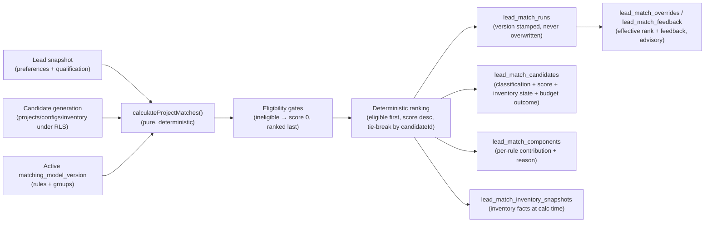

# Matching Architecture (Phase 6B)

Phase 6B delivers **deterministic project matching** — versioned, explainable, reproducible, and **advisory-only**. Matching records an opinion about which projects, configurations, and units could suit a lead; it never assigns a lead, changes the lead's stage, status, or score, never reserves or books inventory, and never sends anything. This document describes the components, the data flow, the three match levels, the determinism guarantees, the advisory-only boundary, the recalculation triggers, and idempotency.

Matching builds on the deterministic scoring engine ([`SCORING_ENGINE.md`](./SCORING_ENGINE.md), [`SCORING_ARCHITECTURE.md`](./SCORING_ARCHITECTURE.md)) and is advisory in exactly the same sense: it proposes, a human decides. It complements [`MATCHING_RULES.md`](./MATCHING_RULES.md), [`MATCHING_INVENTORY_SAFETY.md`](./MATCHING_INVENTORY_SAFETY.md), [`MATCHING_EXPLAINABILITY.md`](./MATCHING_EXPLAINABILITY.md), and [`MATCHING_FAIRNESS.md`](./MATCHING_FAIRNESS.md).

---

## 1. Components

The matching subsystem is layered to keep the calculation pure and the side-effecting work thin, mirroring the scoring subsystem.

### 1.1 Domain calculation (`packages/domain/src/matching.ts`)

A single pure function, `calculateProjectMatches({ modelVersion, leadSnapshot, candidates, calculatedAt })`, is the source of truth for a lead's calculated matches. It is deterministic, versioned, explainable, and reproducible, and it performs **no IO** — it reads its inputs and returns the ranked match result. It depends on nothing framework- or database-specific, so it is exhaustively unit-testable in isolation. The companion fairness guard `assertNoProhibitedMatchInputs` rejects prohibited inputs (the scoring `PROHIBITED_SIGNAL_KEYS`); prohibited inputs are also dropped on calculate.

The function evaluates each candidate through eligibility gates, then ranks the eligible candidates deterministically, attaching a classification, a numeric score, per-rule components, an inventory state, a budget outcome, and confidence/completeness metadata to every candidate.

### 1.2 Database schema (`supabase/migrations/0022_project_matching.sql`)

Fourteen tenant-scoped tables hold the matching-model catalogue, the rules, and the append-only run records (runs, candidates, components, inventory snapshots, overrides, feedback, and an evaluation harness). RLS is enabled on all fourteen tables. The schema enforces several invariants in SQL (an active version is immutable, exactly one active version per model, the recorded model version is never null, and prohibited signals are rejected on rules). See [`DATABASE.md`](./DATABASE.md) §"Phase 6B" for the full table list and constraints.

### 1.3 Candidate generation (Phase 6B surface)

A server layer generates candidates from the tenant's **real** projects, configurations, and inventory, under RLS. Only in-tenant, active, approved, visible, sale-applicable projects produce candidates, and a unit is offered as a candidate at the confirmed level only when it is available and fresh (see [`MATCHING_INVENTORY_SAFETY.md`](./MATCHING_INVENTORY_SAFETY.md)). Candidate generation reads inventory facts; it never alters them.

### 1.4 Server services (Phase 6B surface)

A thin, **record-only** server layer drives the calculation and persists the result. `runLeadMatch` builds the lead snapshot and candidate set under RLS, calls the pure `calculateProjectMatches`, and writes a `lead_match_runs` row (stamped with the exact `model_version_id`, never overwritten), the per-candidate `lead_match_candidates`, the per-rule `lead_match_components`, and the `lead_match_inventory_snapshots` capturing the inventory facts at calculation time. It never mutates the lead's stage, assignment, status, or score, never reserves or books inventory, and never enqueues, drafts, or sends any customer-facing message. Recalculation is invoked through the existing durable-job abstraction (`apps/web/src/lib/jobs/`), which runs local-sync today; production durable (PGMQ) execution is deferred ([`TECH_DEBT.md`](./TECH_DEBT.md)). Override and feedback services let a user adjust an effective rank or record feedback without changing the calculated record. A review-only AI preference-extraction step proposes structured preferences for human review; the AI never determines the final ranking.

### 1.5 UI (Phase 6B surface)

A read-first, advisory surface: `/settings/matching` (model lifecycle + draft rule editor), `/matching/test-lab` (a deterministic test mode in which **no lead, project, or inventory is updated**), a per-lead matching panel, and a permission-scoped "potentially matching leads" view on `/projects/[id]`. See [`PAGE_MAP.md`](./PAGE_MAP.md) §"Phase 6B".

## 2. Data flow

1. **Lead snapshot + candidate generation.** The lead's structured preferences and qualification are snapshotted, and candidates are generated from the tenant's real projects, configurations, and inventory under RLS. Prohibited inputs are rejected by `assertNoProhibitedMatchInputs` and dropped on calculate.
2. **Eligibility.** Each candidate passes through the eligibility gates before ranking. An ineligible candidate is classified `ineligible`, scored 0, and ranked after every eligible candidate.
3. **Deterministic ranking.** Eligible candidates are ranked by score (descending), with a stable tie-break by `candidateId`; ineligible candidates follow. Each candidate carries its classification, inventory state, budget outcome, and the per-rule components that explain it.
4. **Run + candidates + components + inventory snapshots.** The result is persisted. The run stamps the exact `model_version_id` (`NOT NULL`) so the matches are reproducible against the rules that produced them; runs are never overwritten, and the inventory snapshot records the facts the matches rested on. The preference/qualification snapshots and `inventory_snapshot_at` are recorded on the run.
5. **Overrides / feedback.** A user may overlay an effective rank or record feedback; both are advisory records that never alter the calculated run, the lead, or inventory.

## 3. The three match levels (not interchangeable)

Matching is computed and presented at three distinct levels, and they are **not** interchangeable — collapsing them would let a project-level "good fit" be mistaken for a confirmed, available unit.

- **Project** — the lead suits the project overall (location, property type, broad budget and possession fit). A project-level match says "worth considering", not "a unit is available now".
- **Configuration** — a specific configuration within the project (for example, a particular bedroom count / layout / size band) matches the lead's stated configuration and budget. A configuration match narrows the project to a buildable type the lead wants.
- **Unit** — an individual inventory unit. A unit may be presented as **confirmed available** only when it is verified available (in-tenant, active+approved project, configuration match, status available, within the freshness window, no reservation conflict, and the user is permitted). Otherwise the unit is not presented as confirmed and re-verification is requested.

Because a project-level recommendation can stand while no specific unit is confirmable, the levels are tracked separately. A stale or absent unit never silently downgrades into a confirmed recommendation, and a confirmed unit is never implied by a mere project-level match. See [`MATCHING_INVENTORY_SAFETY.md`](./MATCHING_INVENTORY_SAFETY.md).

## 4. Determinism and reproducibility guarantees

- **Pure calculation.** `calculateProjectMatches` has no IO, no clock read (the caller supplies `calculatedAt`), and no randomness. Identical `{ modelVersion, leadSnapshot, candidates, calculatedAt }` always yield an identical result.
- **Stable deterministic ranking.** Eligible candidates rank first, then by score descending, with a stable tie-break by `candidateId`. Ineligible candidates (score 0) follow. The order, the component list, and the classifications are reproducible for identical inputs.
- **Versioned and stamped.** Every match run records the exact model version used. Because an active version is immutable (rule edits are blocked by the `active_matching_version_is_immutable` trigger — you draft a new version instead), a stamped historical match run can be recomputed and will match.
- **Snapshots preserve the basis.** The run stores the preference/qualification snapshots, the `inventory_snapshot_at`, and per-candidate inventory snapshots, so the inventory facts a run rested on are preserved even as live inventory changes. Runs are never overwritten.

## 5. Advisory-only boundary

Matching is **record-only / advisory** in Phase 6B. The calculation and the server services:

- never assign a lead, and never change a lead's pipeline stage, assignment, status, or score;
- never reserve, hold, book, or otherwise alter inventory or project facts;
- never change a conversation's operating mode or take any conversation action;
- never enqueue, draft, or send any customer-facing message.

Automatic lead assignment, stage, status, or score changes driven by a match are a **separate, later, explicitly-approved automation phase** and are out of scope for Phase 6B. Inventory reservation and booking are never part of matching. The Phase 5B.1 external stop-line is preserved unchanged: automatic customer sending remains impossible, and scoring and matching are advisory-only. A strong match is an opinion surfaced to a human, not an action.

## 6. Recalculation triggers

A lead's matches are recalculated only on **meaningful** events — not on every insignificant write. The intended trigger set is:

- a lead is created;
- a buyer preference or qualification field changes;
- a meaningful inbound message that changes preferences arrives;
- an AI preference extraction is approved (the reviewed preferences feed the snapshot);
- inventory or pricing that affects fit changes (a configuration's availability or price moves);
- a project is activated, approved, made visible, or retired;
- a matching model version is activated (recompute under the new version is explicit, never retroactively rewriting past stamps);
- a manual recalculation is requested.

Insignificant or noisy events do **not** trigger recalculation. Each trigger is recorded on the run so the cause of any change is auditable.

## 7. Idempotency

Recalculation runs through the durable-job abstraction and is safe to retry. Re-running the calculation for the same lead and model version with the same lead snapshot and candidates produces the same result; a fresh run row is written (runs are append-only and never overwritten) and is correlated so duplicate triggers are traceable and do not corrupt the history. Because the calculation is pure and the version is stamped, replaying a trigger never changes the lead's recorded state beyond appending a reproducible run, and it never touches inventory. Production durable (PGMQ) execution of these recalculations is deferred; local-sync execution is used today ([`TECH_DEBT.md`](./TECH_DEBT.md)).
