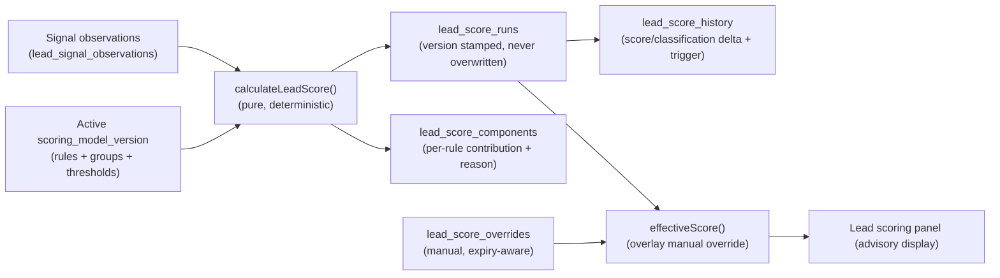

# Scoring Architecture (Phase 6A)

Phase 6A delivers **deterministic lead scoring** — versioned, explainable, reproducible, and **advisory-only**. Scoring records an opinion about a lead; it never changes the lead's stage, assignment, status, conversation operating mode, or sends anything. This document describes the components, the data flow, the determinism guarantees, the advisory-only boundary, the recalculation triggers, and idempotency.

It complements [`SCORING_ENGINE.md`](./SCORING_ENGINE.md) (the conceptual model and the Phase 6A note), [`SCORING_RULES.md`](./SCORING_RULES.md), [`SCORING_SIGNALS.md`](./SCORING_SIGNALS.md), [`SCORING_EXPLAINABILITY.md`](./SCORING_EXPLAINABILITY.md), and [`SCORING_FAIRNESS.md`](./SCORING_FAIRNESS.md).

---

## 1. Components

The scoring subsystem is layered to keep the calculation pure and the side-effecting work thin.

### 1.1 Domain calculation (`packages/domain/src/scoring.ts`)

A single pure function, `calculateLeadScore({ modelVersion, observations, calculatedAt })`, is the source of truth for a lead's calculated score. It is deterministic, versioned, explainable, and reproducible, and it performs **no IO** — it reads its inputs and returns a `LeadScoreResult`. It depends on nothing framework- or database-specific, so it is exhaustively unit-testable in isolation. Companion pure helpers include `effectiveScore` (manual-override overlay), `validateThresholds` (threshold ordering), `assertNoProhibitedSignals` (fairness guard), and `isProhibitedSignal`.

### 1.2 Database schema (`supabase/migrations/0021_lead_scoring.sql`)

Fourteen tenant-scoped tables hold the model catalogue, signal definitions, recorded observations, and the append-only score history. RLS is enabled on all fourteen tables. The schema enforces several invariants in SQL (an active version is immutable, exactly one active version per model, the recorded model version is never null, and prohibited signals are rejected on rules and definitions). See [`DATABASE.md`](./DATABASE.md) §"Phase 6A" for the full table list and constraints.

### 1.3 Server services (Phase 6A surface)

A thin server layer records observations and persists score runs. It calls the pure `calculateLeadScore`, writes a `lead_score_runs` row (stamped with the exact `model_version_id`, never overwriting history), the per-rule `lead_score_components`, and a `lead_score_history` delta. It is **record-only**: it never mutates the lead's stage, `lead_assignments`, lead status, conversation operating mode, or any outbound path. Recalculation is invoked through the existing durable-job abstraction (`apps/web/src/lib/jobs/`), which runs local-sync today; production durable (PGMQ) execution is deferred ([`TECH_DEBT.md`](./TECH_DEBT.md)).

### 1.4 UI (Phase 6A surface)

A read-first surface: model and signal settings, an evaluation lab, and a per-lead scoring panel that renders the explanation. The scoring panel shows the calculated score, classification, contributing rules, missing and stale evidence, and any manual override. See [`PAGE_MAP.md`](./PAGE_MAP.md) §"Phase 6A".

## 2. Data flow

1. **Observations** are recorded against a lead (and optionally a project) with full provenance — value, value type, signal state, source type, source record, observation time, verification state, confidence, expiry, supersede marker, and correlation id. Prohibited observations are rejected by a DB CHECK and dropped by the domain layer.
2. **Deterministic calculation** reads the active model version's rules + groups + thresholds and the lead's observations, and returns the score, classification, components, applied/skipped rules, missing signals, contradictions, disqualification/review flags, evidence completeness, calculation confidence, and a human-readable explanation.
3. **Score run + history** persists the result. The run stamps the exact `model_version_id` (`NOT NULL`) so the score is reproducible against the rules that produced it; history is append-only and never overwritten.
4. **Effective score** overlays any active manual override on top of the calculated values. Expired overrides are ignored. The calculated values are always preserved underneath, so an override never destroys the underlying machine opinion.

## 3. Determinism and reproducibility guarantees

- **Pure calculation.** `calculateLeadScore` has no IO, no clock read (the caller supplies `calculatedAt`), and no randomness. Identical `{ modelVersion, observations, calculatedAt }` always yield an identical `LeadScoreResult`.
- **Deterministic ordering.** Rules are evaluated in a stable order (priority, then id), so the explanation and component list are reproducible.
- **Versioned and stamped.** Every score run records the exact model version used. Because an active version is immutable (rule edits are blocked by the `active_model_version_is_immutable` trigger — you draft a new version instead), a stamped historical score can be recomputed and will match.
- **History is append-only.** Runs and history rows are never overwritten, so the full timeline of "what the score was, under which version, and why it changed" is preserved.

## 4. Advisory-only boundary

Scoring is **record-only / advisory** in Phase 6A. The calculation and the server services:

- never change a lead's pipeline stage, assignment, or status;
- never change a conversation's operating mode or take any conversation action;
- never enqueue, draft, or send any customer-facing message;
- never alter inventory or project facts.

Automatic pipeline, stage, assignment, or status changes driven by a score are a **separate, later, explicitly-approved automation phase** and are out of scope for Phase 6A. The Phase 5B.1 external stop-line is preserved unchanged: automatic customer sending remains impossible. A high score is an opinion surfaced to a human, not an action.

## 5. Recalculation triggers

A score is recalculated only on **meaningful** events — not on every insignificant write. The intended trigger set is:

- a lead is created;
- a buyer preference or qualification field changes;
- a meaningful inbound message arrives;
- a call is logged;
- a task is completed;
- a site visit is recorded;
- a reviewed source correction is applied;
- a duplicate is resolved (merge);
- an AI extraction is approved (the approved signal becomes an observation);
- a model version is activated (recompute under the new version is explicit, never retroactively rewriting past stamps);
- a manual recalculation is requested.

Insignificant or noisy events (for example, a read receipt or a presence ping) do **not** trigger recalculation. Each trigger is recorded on the run (`lead_score_runs.trigger`) and carried into history so the cause of any change is auditable.

## 6. Idempotency

Recalculation runs through the durable-job abstraction and is safe to retry. Re-running the calculation for the same lead and model version with the same observations produces the same result; a fresh run row is written (history is append-only) and is keyed/correlated (`correlation_id`) so duplicate triggers are traceable and do not corrupt the timeline. Because the calculation is pure and the version is stamped, replaying a trigger never changes the lead's recorded state beyond appending a reproducible run. Production durable (PGMQ) execution of these recalculations is deferred; local-sync execution is used today ([`TECH_DEBT.md`](./TECH_DEBT.md)).
