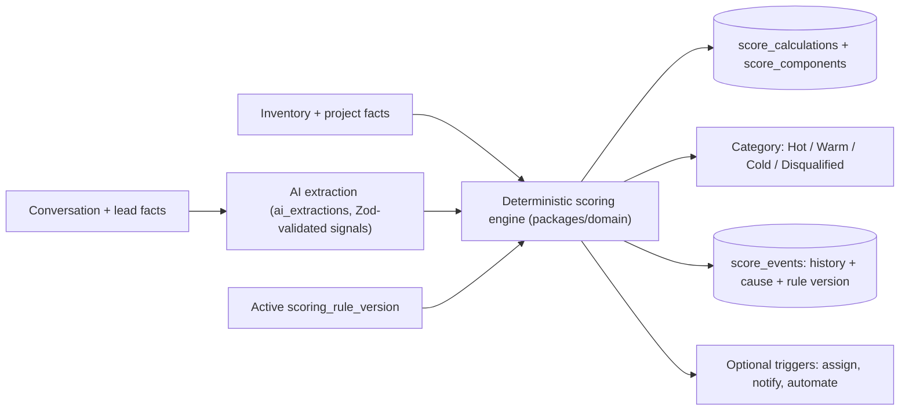

# Scoring & Matching Engine

Derived from [`MASTER_SPEC.md`](./MASTER_SPEC.md) §14–16. The scoring engine is **deterministic and explainable**: AI extracts signals; rules compute the official score. Implemented as pure functions in `packages/domain` (framework- and DB-independent), unit-tested exhaustively.

---

## 1. Hybrid model

**Invariant:** the AI never writes the final score. It only provides validated signals (budget, timeline, intent, etc.). The engine reads signals + hard facts and computes 0–100.

## 2. Score components (default rule set)

Internal score **0–100**; category displayed prominently. Components and caps follow the spec exactly.

### A. Project & buyer fit — max 40

| Signal                              | Points   |
| ----------------------------------- | -------- |
| Budget fits available inventory     | +20      |
| Budget within 10% of minimum        | +14      |
| Budget within 20% of minimum        | +7       |
| Exact configuration match           | +8       |
| Property category match             | +4       |
| Preferred location or project match | +4       |
| Purchase purpose captured           | +2       |
| Important amenity match             | up to +2 |

_(Budget tiers are mutually exclusive — take the best applicable.)_

### B. Buyer intent — max 30 (cap applies)

| Signal                                   | Points |
| ---------------------------------------- | ------ |
| Explicitly requests a site visit         | +20    |
| Asks about booking procedure             | +10    |
| Requests current availability            | +8     |
| Requests price sheet / payment plan      | +6     |
| Requests a callback                      | +6     |
| Requests floor plan / brochure           | +4     |
| Detailed project-comparison questions    | +4     |
| Mentions actively evaluating competitors | +4     |

### C. Urgency — max 20

| Purchase timeline     | Points |
| --------------------- | ------ |
| ≤ 30 days             | +20    |
| 31–90 days            | +14    |
| 3–6 months            | +8     |
| 6–12 months           | +3     |
| > 12 months / unknown | +0     |

### D. Engagement — max 10 (cap applies)

| Signal                           | Points   |
| -------------------------------- | -------- |
| Confirms callback or site visit  | +4       |
| Responds promptly                | up to +3 |
| ≥ 3 meaningful exchanges         | +3       |
| Opens/requests relevant material | +2       |
| Returns to conversation          | +2       |

### Negative signals

| Signal                                                    | Effect                                           |
| --------------------------------------------------------- | ------------------------------------------------ |
| Rental-only requirement                                   | **Hard disqualification**                        |
| Job seeker / vendor / spam                                | **Hard disqualification**                        |
| Explicit opt-out                                          | **Hard stop + do-not-contact**                   |
| Invalid contact information                               | Strong penalty + review                          |
| Budget > 20% below all matching inventory, no flexibility | −25                                              |
| No response 24h / +72h / +7d                              | −3 / −5 / −7 (cumulative)                        |
| Repeated unrelated responses                              | −5                                               |
| Timeline > 1 year                                         | No urgency points; **not** auto-disqualification |

**Non-response is not disqualification** — such leads move to **Dormant/Nurturing** operational status.

## 3. Categories & statuses

**Category thresholds (defaults, configurable):** Hot **75–100**, Warm **45–74**, Cold **0–44**, Disqualified via an approved hard rule. A **confirmed site-visit request may temporarily set Hot** even with missing fields.

**Operational statuses** (separate axis): New, Qualifying, Needs human review, Nurturing, Dormant. A lead has both a category and an operational status.

## 4. Explainability

Every score surfaces: current numeric score, category, positive factors, negative factors, missing important information, last score change, the event that caused it, rule version used, AI-extracted evidence, confidence, and recommended next action. Full history is retained in `score_events` + `score_components`. The UI score panel renders this directly (see [`UI_SYSTEM.md`](./UI_SYSTEM.md)).

## 5. No-code rule builder

A tenant-configurable engine over conditions and actions.

**Conditions:** field value, range, source, campaign, project, property category, configuration, budget, timeline, conversation intent, message count, site-visit activity, document activity, agent action, time since response, custom fields.

**Actions:** add points, subtract points, set category, disqualify, require review, assign an agent, start automation, stop automation, notify a manager, add a tag.

**Lifecycle:** Draft → Test mode → Historical simulation → Publish → Rollback. Rules carry priority, cap, effective date, and full audit history (`scoring_rule_versions`, `scoring_simulations`). Publishing requires `scoring.publish`; Marketing edits require approval ([`PERMISSIONS_MATRIX.md`](./PERMISSIONS_MATRIX.md)).

**Determinism rules:** rules evaluate in priority order; component caps are enforced after summation; hard-disqualification short-circuits positive scoring; the rule version is stamped on every calculation so historical scores are reproducible.

## 6. Predictive scoring (optional, later)

Start rule-based. Collect historical outcomes per tenant. After sufficient data, add an **optional** conversion-probability model that:

- never silently replaces rule scoring — the UI shows **rule score + predictive probability + model confidence** side by side;
- must be validated and approved before influencing prioritization;
- is **never trained across tenants** without explicit authorization;
- **never uses protected attributes** (religion, caste, gender, ethnicity, disability, etc.).

This is out of scope for the initial build but the data model (`score_events`, outcomes) is designed to support it.

## 7. Project-matching engine (deterministic)

Separate pure module in `packages/domain`.

**Hard filters (exclude):** sale only; property category; available inventory only; location restrictions; required configuration; max budget where specified.

**Ranking factors:** budget fit, configuration fit, location fit, possession fit, category fit, amenity fit, buyer purpose, inventory availability, buyer-stated priorities.

**Returns:** match percentage, top matching projects, matching configurations, matching available units, recommendation reason, mismatch warnings, information still needed.

**Invariant:** AI may _explain_ a match but must not create or alter inventory facts. Matching reads only current, real inventory; it never recommends Booked/Sold/Unavailable units.

## 8. Recompute triggers

Score and matches recompute on: new inbound/extracted signal, qualification field change, inventory/price change affecting fit, stage change, time-decay events (24h/72h/7d non-response), and rule-set publish (recompute under the new version is explicit, not retroactive to historical stamps).

## 9. Testing focus (must pass before the phase ships)

Unit tests for: each component's points and caps, mutually-exclusive budget tiers, hard-disqualification short-circuit, negative-signal accumulation, category threshold boundaries (44/45, 74/75), temporary-Hot on site-visit request, non-response → dormant (not disqualified), rule priority/cap/effective-date behaviour, historical simulation reproducibility, and matching hard-filter correctness (never returns unavailable units). See [`TEST_PLAN.md`](./TEST_PLAN.md).

## Phase 6A — deterministic lead scoring (2026-06-20)

Phase 6A implements the deterministic core of this engine as a versioned, explainable, reproducible, and strictly **advisory / record-only** subsystem. The new companion docs carry the detail: [`SCORING_ARCHITECTURE.md`](./SCORING_ARCHITECTURE.md), [`SCORING_RULES.md`](./SCORING_RULES.md), [`SCORING_SIGNALS.md`](./SCORING_SIGNALS.md), [`SCORING_EXPLAINABILITY.md`](./SCORING_EXPLAINABILITY.md), and [`SCORING_FAIRNESS.md`](./SCORING_FAIRNESS.md).

**Implemented (domain + DB):**

- `packages/domain/src/scoring.ts` — pure `calculateLeadScore({ modelVersion, observations, calculatedAt })` (no IO), plus `effectiveScore`, `validateThresholds`, `assertNoProhibitedSignals`, `isProhibitedSignal`.
- 11 rule operators (`boolean_true`, `numeric_range`, `enum_in`, `date_recency`, `count_gte`, `completion`, `exact_match`, `set_intersection`, `missing_value`, `disqualify`, `review_required`); 8 rule groups (intent, fit, engagement, source, freshness, qualification, negative, disqualification); group caps/minimums, total bounds, and a 0–100 scale clamp.
- 6 signal states (known, unknown, not_applicable, contradictory, stale, unverified); per-rule unknown handling `zero | review | skip` (default `zero` — unknown contributes zero, reduces evidence completeness, never disqualifies).
- Classifications hot/warm/cold/disqualified/unscored/review_required with tenant-configurable thresholds validated by `validateThresholds`.
- Evidence completeness and calculation confidence tracked **separately** from the numeric score (a high score never implies complete qualification).
- `migration 0021` — 14 tenant-scoped tables, RLS on all, the immutable-active-version trigger, one-active-version index, version-stamped runs (`model_version_id NOT NULL`), append-only history, 8 permissions, 17 audit actions, and a per-tenant synthetic seed.

**Advisory-only boundary:** scoring records an opinion and never changes a lead's stage, assignment, status, or conversation mode, and never sends anything. Automatic pipeline/stage/assignment/status changes are a later, explicitly-approved automation phase. **Deferred:** project matching (Phase 6B), production durable (PGMQ) recalculation (local-sync today), and any live customer sending (Phase 5B.1, externally blocked — the stop-line is preserved). The "no-code rule builder" (§5) and "project-matching engine" (§7) above describe the eventual full system; Phase 6A delivers the deterministic scoring core and its advisory surface only.

## Phase 6B — deterministic project matching (2026-06-20)

Phase 6B implements the deterministic project-matching engine (§7 above) as a versioned, explainable, reproducible, and strictly **advisory / record-only** subsystem. Matching **builds on** the deterministic scoring core (it reuses the scoring fairness catalogue and the same "AI proposes, deterministic engine decides" discipline) and is advisory in exactly the same sense as scoring: it proposes a fit opinion that a human reviews. The detail lives in the new companion docs: [`MATCHING_ARCHITECTURE.md`](./MATCHING_ARCHITECTURE.md), [`MATCHING_RULES.md`](./MATCHING_RULES.md), [`MATCHING_INVENTORY_SAFETY.md`](./MATCHING_INVENTORY_SAFETY.md), [`MATCHING_EXPLAINABILITY.md`](./MATCHING_EXPLAINABILITY.md), and [`MATCHING_FAIRNESS.md`](./MATCHING_FAIRNESS.md).

**Implemented (domain + DB):**

- `packages/domain/src/matching.ts` — pure `calculateProjectMatches({ modelVersion, leadSnapshot, candidates, calculatedAt })` (no IO), plus `assertNoProhibitedMatchInputs`. Three match **levels** (project / configuration / unit) treated distinctly; 14 operators; rule **kinds** hard / soft / informational / review_required; 12 rule groups with caps/minimums and total normalization; 7 eligibility gates (ineligible → score 0, ranked last); classifications excellent / good / possible / weak / ineligible / review_required / insufficient_information; 6 inventory states (a unit is confirmed only when `verified_available`); 7 budget outcomes (no invented charges). Match confidence and preference completeness are tracked **separately** from the numeric score; ranking is stable and deterministic (eligible first, score desc, tie-break by candidateId).
- `migration 0022` — 14 tenant-scoped tables, RLS on all, the immutable-active-version trigger, one-active-version index, version-stamped runs (`model_version_id NOT NULL`), the prohibited-input CHECK on both rule sides, 8 permissions, 16 audit actions, and a per-tenant synthetic seed.

**Advisory-only boundary:** matching records a fit opinion and **never assigns a lead, changes a lead's stage, status, or score, reserves or books inventory, or sends anything**. Project matching does **not** determine the final ranking from AI — AI only proposes reviewable structured preferences. **Deferred:** automatic lead assignment / stage / status / score change (a later, explicitly-approved automation phase only), inventory reservation/booking (never in matching), production durable (PGMQ) recalculation (local-sync today), live travel-time/traffic data (Unknown unless a trusted stored distance fact exists), and any live customer sending (Phase 5B.1, externally blocked). The Phase 5B.1 external stop-line is preserved unchanged: automatic customer sending remains impossible, and scoring and matching are advisory-only.
